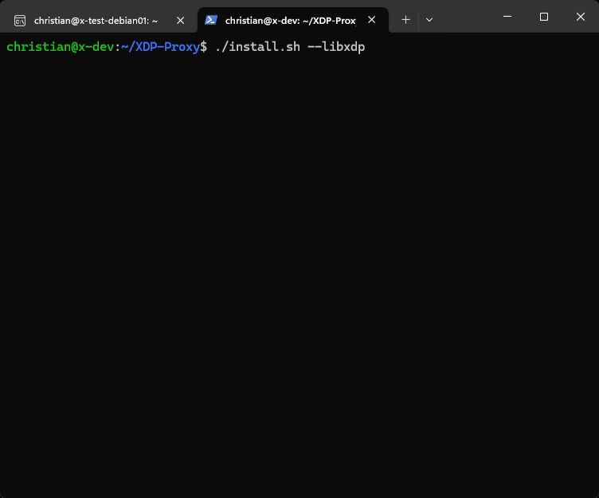
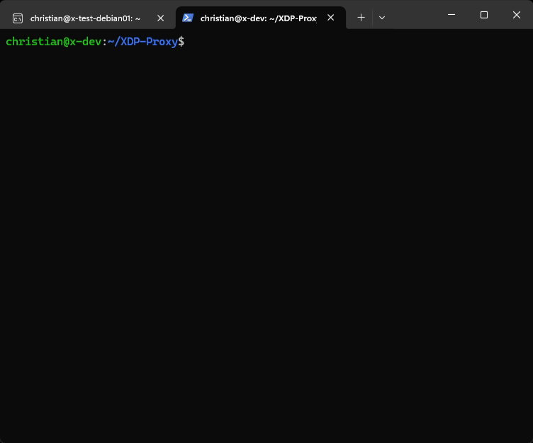

[](https://github.com/gamemann/XDP-Proxy/actions/workflows/build.yml) [](https://github.com/gamemann/XDP-Proxy/actions/workflows/run.yml)

A *stateless*, high-performance NAT-like proxy that attaches to the [XDP](https://www.iovisor.org/technology/xdp) hook in the Linux kernel using [(e)BPF](https://ebpf.io/) for fast packet processing.

This proxy forwards packets based on configurable rules and performs **source-port mapping**, similar to [IPTables](https://linux.die.net/man/8/iptables) and [NFTables](https://wiki.nftables.org/wiki-nftables/index.php/Main_Page).


## 🚀 Features Overview
All features can be enabled or disabled through the build-time configuration ([`config.h`](./src/common/config.h) before compilation) or runtime configuration on disk.

### 📡 High-Performance Packet Forwarding
* **XDP-Powered** - Runs at the earliest point in the network stack for **minimal latency**.
* **eBPF-Based** - Uses BPF maps for efficient rule lookups and packet processing.
* Supports **Layer 3 & Layer 4** packet forwarding.
* Implements **source-port mapping**, similar to how [IPTables](https://linux.die.net/man/8/iptables) and [NFTables](https://wiki.nftables.org/wiki-nftables/index.php/Main_Page) handle it.

### 📊 Real-Time Packet Counters
* Track **forwarded, passed, dropped** packets in real time.
* Supports **per-second statistics** for better traffic analysis.

### 📜 Logging System
* Built-in **logging** to terminal and/or a file.
* Configurable **verbosity levels** to control log output.

### 📌 Pinned Maps & CLI Utilities
* **Pinned BPF maps** allow external programs to interact with forward rules.
* CLI utilities (`xdpfwd-add`, `xdpfwd-del`) enable **dynamic rule** management without restarting the proxy.

## 🛠️ Building & Installing
Before building, ensure the following packages are installed. These packages can be installed with `apt` on Debian-based systems (e.g. Ubuntu, etc.), but there should be similar names in other package managers.

```bash
# Install dependencies.
sudo apt install -y libconfig-dev llvm clang libelf-dev build-essential

# Install dependencies for building LibXDP and LibBPF.
sudo apt install -y libpcap-dev m4 gcc-multilib

# You may need tools for your Linux kernel since BPFTool is required.
# If this doesn't work and you still run into issues, I'd suggest building BPFTool from source (https://github.com/libbpf/bpftool).
sudo apt install -y linux-tools-$(uname -r)
```

You can use `git` to clone this project. Make sure to include the `--recursive` flag so it downloads the XDP Tools sub-module! Otherwise, you will need to execute `git submodule update --init` while in the cloned repository's directory.

```bash
# Clone repository via Git. Use recursive flag to download XDP Tools sub-module.
git clone --recursive https://github.com/gamemann/XDP-Proxy.git

# Change directory to cloned repository.
cd XDP-Proxy
```

From here, you have two options to build and install the proxy.

### With Bash Script
The easiest way to build and install the proxy is to use the provided [`install.sh`](./install.sh) Bash script. This script relies on `sudo` being installed on your system. If you do not have sudo, please refer to the below steps on building and installing this tool without the Bash script.

If you don't have LibXDP installed on your system yet, I'd recommend using the following command.

```bash
./install.sh --libxdp
```

Otherwise, you can exclude the `--libxdp` flag if you'd like.

Additionally, here is a list of flags you may pass to this script.

| Name | Description |
| ---- | ----------- |
| --libxdp | Build and install LibXDP before building the tool. |
| --no-install | Build the tool and/or LibXDP without installing them. |
| --clean | Remove build files for the tool and LibXDP. |
| --no-static | Do *not* statically link LibXDP and LibBPF object files when building the tool. This makes the build process faster, but you may need to alter your `LD_LIBRARY_PATH` env variable before running the tool and requires LibXDP to be installed on your system already. |
| --objdump | Dumps the XDP/BPF object file using [`llvm-objdump`](https://llvm.org/docs/CommandGuide/llvm-objdump.html) to Assemby into `objdump.asm`. This is used for debugging. |
| --help | Displays help message. |



### Without Bash Script
If you do not want to use the Bash script above, you may use `make` to build and install this tool instead.

```
# Build XDP-Tools (LibXDP and LibBPF).
make libxdp

# Install LibXDP & LibBPF onto your system.
# Warning: This command must be executed as root! `sudo` should do this for you if you have it installed and have privileges.
sudo libxdp_install

# Build the proxy tool.
make

# Install the tool onto your system.
# Warning: This command must be executed as root! `sudo` should do this for you if you have it installed and have privileges.
sudo make install
```



## 💻 CLI Usage
The following command line arguments are supported when running the proxy.

| Name | Default | Description |
| ---- | ------- | ----------- |
| -c, --config | `/etc/xdpfwd/xdpfwd.conf` | The path to the config file. |
| -o, --offload | N/A | If set, attempts to load the XDP program in hardware/offload mode. |
| -s, --skb | N/A | If set, forces the XDP program to be loaded using SKB mode instead of DRV mode. |
| -t, --time | N/A | If set, will run the tool for this long in seconds. E.g. `--time 30` runs the tool for 30 seconds before exiting. |
| -l, --list | N/A | If set, will print the current config values and exit. |
| -h, --help | N/A | Prints a help message. |

Additionally, there are command line overrides for base config options you may include.

| Name | Example | Description |
| ---- | ------- | ----------- |
| -v, --verbose | `-v 3` | Overrides the config's verbose value. |
| --log-file | `--log-file ./test.log` | Overrides the config's log file value. |
| -i, --interface | `-i enp1s0` | Overrides the config's first interface value. |
| -p, --pin-maps | `-p 0` | Overrides the config's pin maps value. |
| -u, --update-time | `-u 30` | Overrides the config's update time value. |
| -n, --no-stats | `-n 1` | Overrides the config's no stats value. |
| --stats-ps | `--stats-ps 1` | Overrides the config's stats per second value. |
| --stdout-ut | `--stdout-ut 500` | Overrides the config's stdout update time value. |

## ⚙️ Configuration
There are two configuration methods for this proxy:

1️⃣ **Build-Time Configuration** - Modify hard-coded constants in [`config.h`](./src/common/config.h) by commenting (`//`) or uncommenting options along with setting values. Since these settings are required at build time, the proxy must be rebuilt for changes to take effect.

2️⃣ **Runtime Configuration** - Settings can also be adjusted via a configuration file stored on disk. By default, this file is located at `/etc/xdpfwd/xdpfwd.conf`, but you can specify a different path using the `-c` or `--config` CLI options.

The [`libconfig`](https://hyperrealm.github.io/libconfig/libconfig_manual.html) library and syntax is used when parsing the config file.

Here are more details on the layout of the runtime configuration.

### Main
| Name | Type | Default | Description |
| ---- | ---- | ------- | ----------- |
| verbose | int | `2` | The verbose level for logging (0 - 5 supported so far). |
| log_file | string | `/var/log/xdpfwd.log` | The log file location. If the string is empty (`""`), the log file is disabled. |
| interface | string \| list of strings | `NULL` | The network interface(s) to attach the XDP program to (usually retrieved with `ip a` or `ifconfig`). |
| pin_maps | bool | `true` | Pins main BPF maps to `/sys/fs/bpf/xdpfwd/[map_name]` on the file system. |
| update_time | int | `0` | How often to update the config and forwarding rules from the file system in seconds (< 1 disables). |
| no_stats | bool | `false` | Whether to enable or disable packet counters. Disabling packet counters will improve performance, but result in less visibility on what the proxy is doing. |
| stats_per_second | bool | `false` | If true, packet counters and stats are calculated per second. `stdout_update_time` must be 1000 or less for this to work properly. |
| stdout_update_time | int | `1000` | How often to update `stdout` when displaying packet counters in milliseconds. |
| rules | list of forward rule objects | `()` | A list of forward rules. |

### Forward Rule Object
| Name | Type | Default | Description |
| ---- | ---- | ------- | ----------- |
| enabled | bool | `true` | Whether the rule is enabled or not. |
| log | bool | `false` | Whether to log new connections to terminal and/or log file. |
| protocol | string | N/A | The protocol to listen on (`tcp`, `udp`, or `icmp`). |
| bind_ip | string | N/A | The IP to listen on. |
| bind_port | int | N/A | The port to listen on. |
| dst_ip | string | N/A | The destination IP to forward packets to. |
| dst_port | int | N/A | The destination port to forward packets to. |

**NOTE** - As of right now, you can specify up to **256** forward rules. You may increase this limit by raising the `MAX_FWD_RULES` constant in the `src/common/config.h` [file](https://github.com/gamemann/XDP-Proxy/blob/master/src/common/config.h#L4) and then rebuilding the program.

### Runtime Example
Here's a runtime config example.

```squidconf
verbose = 5;
log_file = "";
interface = "ens18";
pin_maps = true;
update_time = 15;
no_stats = false;
stats_per_second = true;

rules = (
    {
        enabled = true;
        log = true;
        protocol = "tcp";
        bind_ip = "10.3.0.2";
        bind_port = 40;
        dst_ip = "10.3.0.3";
        dst_port = 22;
    }
);
```

## 🔧 The `xdpfwd-add` & `xdpfwd-del` Utilities
When the main BPF maps are pinned to the file system (depending on the `pin_maps` runtime option detailed above), this allows you to add or delete forward rules while the proxy is running using the `xdpfwd-add` and `xdpfwd-del` utilities.

### General CLI Usage
The following general CLI arguments are supported with these utilities.

| Name | Example | Description |
| ---- | ------- | ----------- |
| -c, --cfg | `-c ./local/conf` | The path to the configuration file (required if the save argument is specified). |
| -s, --save | `-s` | Updates the runtime config file. |
| -b, --bind-ip | `-b 10.3.0.2` | The bind IP to add or delete. |
| -x, --bind-port | `-x 40` | The bind port to add or delete. |
| -p, --protocol | `-p tcp` | The protocol to use. |

### The `xdpfwd-add` Tool
This CLI tool allows you to add dynamic rules, IP ranges to the drop list, and source IPs to the block list. I'd recommend using `xdpfw-add -h` for more information.

#### Additional CLI Usage
The following CLI arguments are supported.

| Name | Example | Description |
| ---- | ------- | ----------- |
| -e, --enabled | `-e 1` | Enables or disables this forward rule. |
| -l, --log | `-l 1` | Enables or disables logging for this forward rule. |
| -d, --dst-ip | `-d 10.3.0.3` | The destination IP to forward packets to. |
| -y, --dst-port | `-y 22` | The destination port to forward packets to. |

### The `xdpfwd-del` Tool
This CLI tool allows you to delete forward rules while the XDP proxy is running.

There is no additional CLI usage for this tool. Please refer to the general CLI usage above.

## 📝 Notes
### XDP Attach Modes
By default, the proxy attaches to the Linux kernel's XDP hook using **DRV** mode (AKA native; occurs before [SKB creation](http://vger.kernel.org/~davem/skb.html)). If the host's network configuration or network interface card (NIC) doesn't support DRV mode, the program will attempt to attach to the XDP hook using **SKB** mode (AKA generic; occurs after SKB creation which is where IPTables and NFTables are processed via the `netfilter` kernel module). You may use overrides through the command-line to force SKB or offload modes.

Reasons for a host's network configuration not supporting XDP's DRV mode may be the following.

* Running an outdated kernel that doesn't support your NIC's driver.
* Your NIC's driver not yet being supported. [Here's](https://github.com/iovisor/bcc/blob/master/docs/kernel-versions.md#xdp) a NIC driver XDP support list. With enough Linux kernel development knowledge, you could try implementing XDP DRV support into your non-supported NIC's driver (I'd highly recommend giving [this](https://www.youtube.com/watch?v=ayFWnFj5fY8) video a watch!).
* You don't have enough RX/TX queues (e.g. not enabling multi-queue) or your RX/TX queue counts aren't matching. From the information I gathered, it's recommended to have one RX and TX queue per CPU core/thread. You could try learning how to use [ethtool](https://man7.org/linux/man-pages/man8/ethtool.8.html) and try altering the NIC's RX/TX queue settings ([this](https://www.linode.com/docs/guides/multiqueue-nic/) article may be helpful!).

#### Offload Information
Offloading your XDP/BPF program to your system's NIC allows for the fastest packet processing you can achieve due to the NIC dropping the packets with its hardware. However, for one, there are **not** many NIC manufacturers that do support this feature **and** you're limited to the NIC's memory/processing (e.g. your BPF map sizes will be extremely limited). Additionally, there are usually stricter BPF verifier limitations for offloaded BPF programs, but you may try reaching out to the NIC's manufacturer to see if they will give you a special version of their NIC driver raising these limitations (this is what I did with one manufacturer I've used).

At this time, I am not aware of any NIC manufacturers that will be able to offload this proxy completely to the NIC due to its BPF complexity.

### BPF Loop Support
This proxy requires general loop support along with support for the [`bpf_loop()`](https://docs.ebpf.io/linux/helper-function/bpf_loop/) function. Older kernels will not support general loops and output an error such as the following.

```vim
libbpf: load bpf program failed: Invalid argument
libbpf: -- BEGIN DUMP LOG ---
libbpf:
back-edge from insn 113 to 100

libbpf: -- END LOG --
libbpf: failed to load program 'xdp_prog'
libbpf: failed to load object '/etc/xdpfwd/xdp_prog.o'
```

It looks like general BPF loop [support](https://lwn.net/Articles/794934/) was added in kernel 5.3. Therefore, you'll need kernel 5.3 or above for this tool to run properly.

With that said, the `bpf_loop()` function was added in kernel `5.17`, but *may* still require kernel `6.4` or above due to support for open coded iterators. If your kernel doesn't include proper support for `bpf_loop()` and you do not wish to upgrade your kernel, you will need to disable/comment out the `USE_NEW_LOOP` constant in the [`config.h`](./src/common/config.h) file. Please note if you do this, you will be **extremely limited** in how many concurrent source ports you can use (I recommend up to 21). Therefore, it is recommended you use `bpf_loop()` since you will have a much larger source port range!

### Forward Rule Logging
This tool uses `bpf_ringbuf_reserve()` and `bpf_ringbuf_submit()` for logging a message when a new connection is created if the forward rule has logging enabled.

If you'd like to disable forward rule logging entirely (which will improve performance slightly), you may comment out the `ENABLE_RULE_LOGGING` line [here](https://github.com/gamemann/XDP-Proxy/blob/master/src/common/config.h#L11).

```C
//#define ENABLE_RULE_LOGGING
```

### LibBPF Logging
When loading the BPF/XDP program through LibXDP/LibBPF, logging is disabled unless if the `verbose` log setting is set to `5` or higher.

If the tool fails to load or attach the XDP program, it is recommended you set `verbose` to 5 or above so LibXDP outputs specific warnings and errors.

## ❓ F.A.Q.
### Why are binaries and configs named `xdpfwd`?
Originally, this project was called **XDP Forwarding**. After I revamped the project, I decided to rename the main project to **XDP Proxy** since that suits the project more in my opinion. However, executable names like `xdpproxy` doesn't flow as well in my opinion, so I decided to keep binaries and config names/paths set to `xdpfwd`.

## 🌟 My Other XDP Projects
I just wanted to share other open source projects I've made which also utilize XDP (or AF_XDP sockets) for those interested. I hope code from these other projects help programmers trying to utilize XDP in their own projects!

### [XDP Firewall](https://github.com/gamemann/XDP-Firewall)
A *stateless* firewall that attaches to the [XDP](https://www.iovisor.org/technology/xdp) hook in the Linux kernel using [(e)BPF](https://ebpf.io/) for fast packet processing.

This firewall is designed for performance and flexibility, offering features such as dynamic filtering, source IP blocking, IP range dropping, and real-time packet counters. This makes it a powerful tool for network engineers, security professionals, and anyone interested in XDP or high-performance firewalling.

### [Kilimanjaro](https://github.com/gamemann/Kilimanjaro)
This is a complex packet processing/forwarding/dropping project I made for a gaming community I was a part of that utilizes XDP, AF_XDP, and the IPIP network protocol. I no longer work on/maintain the project, but the source code may be very helpful to other XDP developers, especially when it comes to manipulating packets inside of XDP and such.

### [Packet Batch (AF_XDP)](https://github.com/Packet-Batch/PB-AF-XDP)
An application that utilizes fast [AF_XDP](https://docs.kernel.org/networking/af_xdp.html) Linux sockets to generate and send network packets. This is used for penetration testing including [Denial of Service](https://www.cloudflare.com/learning/ddos/glossary/denial-of-service/) (DoS), network monitoring, and more!

While this application doesn't utilize native XDP or (e)BPF, I do feel it should be mentioned here. AF_XDP sockets are very fast and often used with raw XDP programs via the `bpf_redirect_map()` function call (also see my [XDP Stats](https://github.com/gamemann/XDP-Stats) project which calculates stats in raw XDP and AF_XDP programs).

## 🙌 Credits
* [Christian Deacon](https://github.com/gamemann) - Creator.